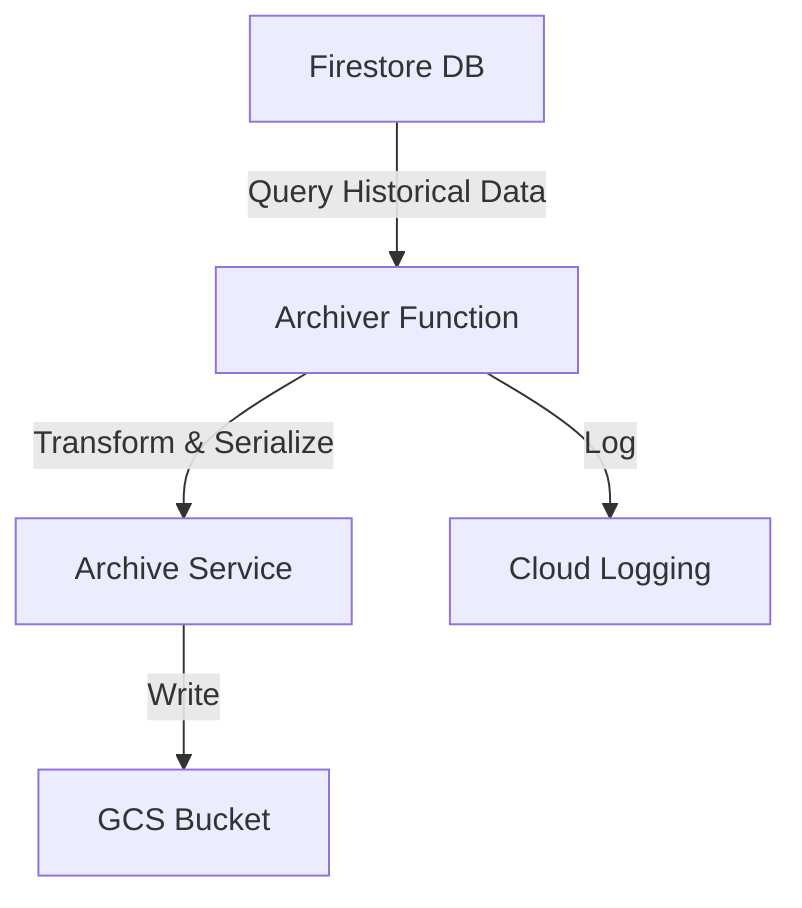

# 📦 Archiver Java Function

Welcome to the **Archiver Java Function**! This service is responsible for archiving historical solar readings from Firestore to Google Cloud Storage (GCS) for long-term retention and analytics.

---

## 📝 What Does It Do?
- Reads daily and historical solar readings from Firestore.
- Transforms and serializes the data (e.g., to CSV or JSON).
- Writes archived data to a GCS bucket, organized by date.
- Optionally cleans up old records from Firestore after archiving.
- Emits logs to Google Cloud Logging for observability.

---

## 🏗️ Tech Stack
- **Java 21**
- **Spring Boot 3.x**
- **Spring Cloud Function (GCP Adapter)**
- **Google Cloud Firestore**
- **Google Cloud Storage**
- **Spring Cloud GCP**
- **Lombok** (for boilerplate reduction)

---

## 🛠️ How It Works



- **Trigger**: Typically invoked on a schedule (e.g., via Cloud Scheduler + Pub/Sub) or manually.
- **Configurable**: Uses `application.properties` for environment-specific settings (Firestore collection names, GCS bucket, etc).

---

## 🚀 Getting Started

### 1. Build
```bash
gradle build
```

### 2. Test
```bash
gradle test
```

### 3. Deploy
- Package as a JAR and deploy to Google Cloud Functions or Cloud Run.
- Set environment variables for GCP project, Firestore, and GCS bucket.

---

## 📂 Key Files & Directories
- `src/main/java/dev/devanks/solarman/archiver/` - Main source code
- `service/FirestoreService.java` - Firestore data access
- `service/StorageWriterService.java` - GCS writing logic
- `function/ArchiveFunction.java` - Cloud Function entry point
- `resources/application.properties` - Configuration

---

## 🧑‍💻 Contributing
Pull requests are welcome! Please ensure code is tested and follows project conventions.

---

## 💬 Contact
For questions, open an issue or contact the maintainer.

